# MER — Modelo Entidade-Relacionamento do AçaíConecta

**Versão:** 0.1  
**Tipo:** Modelo conceitual inicial  
**Status:** Proposta para revisão  
**Fase:** Definição e Prototipação do Produto  
**Última atualização:** Setembro de 2026  
**Fonte de requisitos:** [`../product/PRD.md`](../product/PRD.md)

## 1. Objetivo

Este documento apresenta o Modelo Entidade-Relacionamento inicial do AçaíConecta para o MVP. O modelo representa os conceitos de autenticação, batedeiras, catálogo, áreas de atendimento, pedidos, histórico, notificações e auditoria.

Esta versão ainda não é o esquema físico do banco de dados. Tipos SQL, índices, migrations, políticas de acesso e decisões específicas do provedor serão definidos durante a construção do MVP.

## 2. Premissas

- uma pessoa possui uma conta de usuário e pode desempenhar mais de um papel;
- uma batedeira pode possuir mais de um operador;
- cliente, operador e administrador são papéis, não tipos diferentes de autenticação;
- uma batedeira pode atender vários bairros;
- produtos são arquivados em vez de apagados quando possuem histórico;
- pedidos preservam cópias do endereço e dos dados comerciais dos produtos;
- o estado financeiro é independente do estado operacional do pedido;
- toda mudança de estado do pedido deve ser registrada;
- dinheiro e Pix presencial são as formas de pagamento do MVP;
- dados pessoais e administrativos não devem ser públicos;
- retirada, documentos e algumas regras operacionais permanecem sujeitos a validação.

## 3. Diagrama conceitual

```mermaid
erDiagram
    USUARIOS ||--o{ USUARIOS_PAPEIS : possui
    PAPEIS ||--o{ USUARIOS_PAPEIS : classifica

    USUARIOS ||--o{ BATEDEIRAS_USUARIOS : opera
    BATEDEIRAS ||--o{ BATEDEIRAS_USUARIOS : autoriza

    BATEDEIRAS ||--o{ HORARIOS_FUNCIONAMENTO : configura
    BATEDEIRAS ||--o{ EXCECOES_HORARIO : registra
    BATEDEIRAS ||--o{ AREAS_ENTREGA : atende
    BAIRROS ||--o{ AREAS_ENTREGA : delimita

    CATEGORIAS_PRODUTO ||--o{ PRODUTOS : classifica
    BATEDEIRAS ||--o{ PRODUTOS : oferece

    USUARIOS ||--o{ ENDERECOS_CLIENTES : cadastra
    BAIRROS ||--o{ ENDERECOS_CLIENTES : localiza

    USUARIOS ||--o{ PEDIDOS : realiza
    BATEDEIRAS ||--o{ PEDIDOS : recebe
    PEDIDOS ||--o| PEDIDOS_ENDERECOS : utiliza
    PEDIDOS ||--|{ ITENS_PEDIDO : contem
    PRODUTOS ||--o{ ITENS_PEDIDO : origina

    PEDIDOS ||--|{ HISTORICOS_STATUS_PEDIDO : registra
    USUARIOS ||--o{ HISTORICOS_STATUS_PEDIDO : altera
    MOTIVOS_OCORRENCIA ||--o{ HISTORICOS_STATUS_PEDIDO : justifica

    PEDIDOS ||--o{ MENSAGENS_OPERACIONAIS : recebe
    USUARIOS ||--o{ MENSAGENS_OPERACIONAIS : envia

    USUARIOS ||--o{ NOTIFICACOES : recebe
    PEDIDOS ||--o{ NOTIFICACOES : contextualiza

    USUARIOS ||--o{ AUDITORIAS : executa
```

## 4. Entidades

### 4.1 `usuarios`

Representa qualquer pessoa autenticada na plataforma.

| Atributo | Obrigatório | Descrição |
|---|---|---|
| `id` | Sim | Identificador único. |
| `nome` | Sim | Nome da pessoa. |
| `email` | Sim | E-mail normalizado e único. |
| `telefone` | Sim | Telefone de contato normalizado. |
| `senha_hash` | Condicional | Hash seguro ou referência ao provedor de autenticação. |
| `email_verificado_em` | Não | Momento da verificação do e-mail. |
| `status` | Sim | Estado da conta. |
| `criado_em` | Sim | Data de criação. |
| `atualizado_em` | Sim | Data da última alteração. |

Estados iniciais sugeridos: `PENDENTE`, `ATIVO`, `BLOQUEADO` e `DESATIVADO`.

### 4.2 `papeis`

Catálogo de permissões funcionais de alto nível.

| Atributo | Obrigatório | Descrição |
|---|---|---|
| `id` | Sim | Identificador único. |
| `codigo` | Sim | Código único do papel. |
| `nome` | Sim | Nome para exibição. |
| `descricao` | Não | Finalidade do papel. |

Papéis iniciais: `CLIENTE`, `OPERADOR_BATEDEIRA` e `ADMINISTRADOR`.

### 4.3 `usuarios_papeis`

Associação N:N entre usuários e papéis.

| Atributo | Obrigatório | Descrição |
|---|---|---|
| `usuario_id` | Sim | Referência ao usuário. |
| `papel_id` | Sim | Referência ao papel. |
| `atribuido_em` | Sim | Data da atribuição. |
| `atribuido_por_usuario_id` | Não | Administrador responsável, quando aplicável. |

A combinação `usuario_id + papel_id` deve ser única.

### 4.4 `batedeiras`

Representa o estabelecimento participante.

| Atributo | Obrigatório | Descrição |
|---|---|---|
| `id` | Sim | Identificador único. |
| `nome` | Sim | Nome público da batedeira. |
| `descricao` | Não | Apresentação pública. |
| `telefone_operacional` | Não | Contato privado para operação e suporte. |
| `imagem_url` | Não | Referência da imagem ou logotipo. |
| `logradouro` | Sim | Logradouro do estabelecimento. |
| `numero` | Sim | Número do endereço. |
| `complemento` | Não | Complemento. |
| `bairro_id` | Sim | Bairro do estabelecimento. |
| `ponto_referencia` | Não | Referência de localização. |
| `status_aprovacao` | Sim | Situação administrativa. |
| `aberta_manualmente` | Sim | Controle operacional de abertura. |
| `entrega_disponivel` | Sim | Disponibilidade atual de entrega. |
| `retirada_disponivel` | Sim | Disponibilidade atual de retirada, se habilitada. |
| `pedido_minimo_centavos` | Não | Pedido mínimo padrão. |
| `tempo_estimado_minimo` | Não | Limite inferior da faixa estimada. |
| `tempo_estimado_maximo` | Não | Limite superior da faixa estimada. |
| `criado_em` | Sim | Data de criação. |
| `atualizado_em` | Sim | Data da última alteração. |

Estados administrativos sugeridos: `EM_ANALISE`, `ATIVA`, `SUSPENSA` e `DESATIVADA`.

### 4.5 `batedeiras_usuarios`

Associação entre operadores e batedeiras.

| Atributo | Obrigatório | Descrição |
|---|---|---|
| `id` | Sim | Identificador único. |
| `batedeira_id` | Sim | Batedeira autorizada. |
| `usuario_id` | Sim | Operador autorizado. |
| `papel_operacional` | Sim | Nível operacional dentro da batedeira. |
| `ativo` | Sim | Indica se o vínculo está ativo. |
| `criado_em` | Sim | Data do vínculo. |

A combinação `batedeira_id + usuario_id` deve ser única.

### 4.6 `horarios_funcionamento`

Representa os horários regulares por dia da semana.

| Atributo | Obrigatório | Descrição |
|---|---|---|
| `id` | Sim | Identificador único. |
| `batedeira_id` | Sim | Batedeira relacionada. |
| `dia_semana` | Sim | Dia da semana. |
| `hora_abertura` | Sim | Início do intervalo. |
| `hora_fechamento` | Sim | Final do intervalo. |
| `ativo` | Sim | Indica se o intervalo está vigente. |

Uma batedeira pode possuir mais de um intervalo no mesmo dia.

### 4.7 `excecoes_horario`

Representa feriados, fechamentos extraordinários ou horários especiais.

| Atributo | Obrigatório | Descrição |
|---|---|---|
| `id` | Sim | Identificador único. |
| `batedeira_id` | Sim | Batedeira relacionada. |
| `data` | Sim | Data da exceção. |
| `tipo` | Sim | Fechamento ou horário especial. |
| `hora_abertura` | Condicional | Início do horário especial. |
| `hora_fechamento` | Condicional | Final do horário especial. |
| `motivo` | Não | Justificativa. |

### 4.8 `bairros`

Catálogo padronizado de bairros.

| Atributo | Obrigatório | Descrição |
|---|---|---|
| `id` | Sim | Identificador único. |
| `nome` | Sim | Nome do bairro. |
| `cidade` | Sim | Cidade. |
| `estado` | Sim | Unidade federativa. |
| `ativo` | Sim | Disponibilidade para uso. |

A combinação `nome + cidade + estado` deve ser única.

### 4.9 `areas_entrega`

Associação N:N entre batedeiras e bairros atendidos.

| Atributo | Obrigatório | Descrição |
|---|---|---|
| `id` | Sim | Identificador único. |
| `batedeira_id` | Sim | Batedeira responsável. |
| `bairro_id` | Sim | Bairro atendido. |
| `pedido_minimo_centavos` | Não | Exceção de pedido mínimo para o bairro. |
| `tempo_estimado_minimo` | Não | Estimativa mínima específica. |
| `tempo_estimado_maximo` | Não | Estimativa máxima específica. |
| `ativo` | Sim | Indica se a área está sendo atendida. |

A combinação `batedeira_id + bairro_id` deve ser única.

### 4.10 `categorias_produto`

Classifica os produtos do catálogo.

| Atributo | Obrigatório | Descrição |
|---|---|---|
| `id` | Sim | Identificador único. |
| `nome` | Sim | Nome da categoria. |
| `descricao` | Não | Descrição da categoria. |
| `ativo` | Sim | Disponibilidade da categoria. |

### 4.11 `produtos`

Representa os produtos oferecidos por uma batedeira.

| Atributo | Obrigatório | Descrição |
|---|---|---|
| `id` | Sim | Identificador único. |
| `batedeira_id` | Sim | Proprietária do produto. |
| `categoria_id` | Não | Categoria do produto. |
| `nome` | Sim | Nome comercial. |
| `descricao` | Não | Descrição pública. |
| `imagem_url` | Não | Referência da imagem. |
| `preco_centavos` | Sim | Preço atual em centavos. |
| `unidade` | Sim | Volume ou unidade de venda. |
| `ativo` | Sim | Indica se integra o catálogo atual. |
| `disponivel` | Sim | Disponibilidade operacional atual. |
| `criado_em` | Sim | Data de criação. |
| `atualizado_em` | Sim | Data da última alteração. |
| `arquivado_em` | Não | Data de arquivamento. |

### 4.12 `enderecos_clientes`

Representa endereços reutilizáveis cadastrados pelo cliente.

| Atributo | Obrigatório | Descrição |
|---|---|---|
| `id` | Sim | Identificador único. |
| `usuario_id` | Sim | Proprietário do endereço. |
| `apelido` | Não | Identificação como Casa ou Trabalho. |
| `logradouro` | Sim | Logradouro. |
| `numero` | Sim | Número. |
| `complemento` | Não | Complemento. |
| `bairro_id` | Sim | Bairro padronizado. |
| `ponto_referencia` | Não | Referência para entrega. |
| `principal` | Sim | Indica o endereço preferencial. |
| `ativo` | Sim | Indica se ainda pode ser utilizado. |
| `criado_em` | Sim | Data de criação. |
| `atualizado_em` | Sim | Data da última alteração. |

### 4.13 `pedidos`

Entidade central da operação comercial.

| Atributo | Obrigatório | Descrição |
|---|---|---|
| `id` | Sim | Identificador único. |
| `codigo` | Sim | Código público único para suporte. |
| `cliente_id` | Sim | Usuário que criou o pedido. |
| `batedeira_id` | Sim | Batedeira que recebeu o pedido. |
| `endereco_cliente_id` | Não | Endereço reutilizável de origem. |
| `status_atual` | Sim | Estado operacional atual. |
| `modalidade` | Sim | Entrega ou retirada. |
| `forma_pagamento` | Sim | Dinheiro ou Pix presencial no MVP. |
| `subtotal_centavos` | Sim | Soma dos itens. |
| `total_centavos` | Sim | Total registrado. |
| `troco_para_centavos` | Não | Valor informado para troco. |
| `observacao` | Não | Observação geral. |
| `estimativa_minima` | Não | Limite inferior apresentado. |
| `estimativa_maxima` | Não | Limite superior apresentado. |
| `criado_em` | Sim | Data de criação. |
| `aceito_em` | Não | Data de aceite. |
| `finalizado_em` | Não | Data de chegada ao estado terminal. |
| `atualizado_em` | Sim | Data da última alteração. |

Estados previstos: `AGUARDANDO_ACEITE`, `ACEITO`, `EM_PREPARO`, `PRONTO`, `SAIU_PARA_ENTREGA`, `ENTREGUE`, `RECUSADO`, `EXPIRADO`, `CANCELADO` e `FALHA_NA_ENTREGA`.

### 4.14 `pedidos_enderecos`

Snapshot imutável do endereço utilizado no pedido.

| Atributo | Obrigatório | Descrição |
|---|---|---|
| `pedido_id` | Sim | Pedido relacionado e identificador único. |
| `logradouro` | Sim | Logradouro no momento do pedido. |
| `numero` | Sim | Número. |
| `complemento` | Não | Complemento. |
| `bairro` | Sim | Nome do bairro no momento do pedido. |
| `ponto_referencia` | Não | Referência informada. |

Pedidos de retirada não precisam possuir registro nessa entidade.

### 4.15 `itens_pedido`

Representa cada produto e quantidade incluídos em um pedido.

| Atributo | Obrigatório | Descrição |
|---|---|---|
| `id` | Sim | Identificador único. |
| `pedido_id` | Sim | Pedido relacionado. |
| `produto_id` | Não | Produto que originou o item. |
| `nome_produto` | Sim | Snapshot do nome comercial. |
| `unidade` | Sim | Snapshot da unidade ou volume. |
| `quantidade` | Sim | Quantidade positiva. |
| `preco_unitario_centavos` | Sim | Snapshot do preço unitário. |
| `subtotal_centavos` | Sim | Quantidade multiplicada pelo preço. |
| `observacao` | Não | Observação específica do item. |

`produto_id` poderá ser nulo no histórico caso a política futura permita remoção da referência. Os campos de snapshot permanecem obrigatórios.

### 4.16 `historicos_status_pedido`

Registra de forma append-only as transições do pedido.

| Atributo | Obrigatório | Descrição |
|---|---|---|
| `id` | Sim | Identificador único. |
| `pedido_id` | Sim | Pedido relacionado. |
| `status_anterior` | Não | Estado anterior; nulo apenas na criação. |
| `status_novo` | Sim | Novo estado. |
| `alterado_por_usuario_id` | Não | Usuário responsável. |
| `origem` | Sim | Cliente, batedeira, administrador ou sistema. |
| `motivo_id` | Não | Motivo padronizado. |
| `observacao` | Não | Informação complementar. |
| `criado_em` | Sim | Momento da transição. |

### 4.17 `motivos_ocorrencia`

Catálogo de motivos para recusa, cancelamento, falha na entrega e ações administrativas.

| Atributo | Obrigatório | Descrição |
|---|---|---|
| `id` | Sim | Identificador único. |
| `tipo` | Sim | Categoria da ocorrência. |
| `codigo` | Sim | Código estável. |
| `descricao` | Sim | Texto para exibição. |
| `exige_observacao` | Sim | Obriga complemento textual. |
| `ativo` | Sim | Disponibilidade para novos registros. |

A combinação `tipo + codigo` deve ser única.

### 4.18 `notificacoes`

Registra notificações internas e tentativas de comunicação.

| Atributo | Obrigatório | Descrição |
|---|---|---|
| `id` | Sim | Identificador único. |
| `usuario_id` | Sim | Destinatário. |
| `pedido_id` | Não | Pedido relacionado. |
| `tipo` | Sim | Tipo do evento. |
| `titulo` | Sim | Título apresentado. |
| `mensagem` | Sim | Conteúdo apresentado. |
| `canal` | Sim | Interno, push ou e-mail. |
| `status_envio` | Sim | Situação do envio. |
| `lida_em` | Não | Momento da leitura. |
| `enviada_em` | Não | Momento do envio externo. |
| `criado_em` | Sim | Data de criação. |

### 4.19 `mensagens_operacionais`

Registra mensagens predefinidas vinculadas ao pedido. Não constitui chat livre.

| Atributo | Obrigatório | Descrição |
|---|---|---|
| `id` | Sim | Identificador único. |
| `pedido_id` | Sim | Pedido relacionado. |
| `codigo_mensagem` | Sim | Código da mensagem predefinida. |
| `mensagem` | Sim | Snapshot do texto enviado. |
| `enviada_por_usuario_id` | Não | Usuário responsável; nulo para automação. |
| `criado_em` | Sim | Momento do envio. |

### 4.20 `auditorias`

Registra ações administrativas e alterações sensíveis.

| Atributo | Obrigatório | Descrição |
|---|---|---|
| `id` | Sim | Identificador único. |
| `usuario_id` | Não | Responsável; nulo para ação sistêmica. |
| `acao` | Sim | Ação executada. |
| `entidade` | Sim | Tipo de objeto afetado. |
| `entidade_id` | Sim | Identificador do objeto afetado. |
| `dados_anteriores` | Não | Representação protegida do estado anterior. |
| `dados_novos` | Não | Representação protegida do novo estado. |
| `ip` | Não | IP, quando necessário e justificado. |
| `criado_em` | Sim | Momento do evento. |

Dados sensíveis, segredos e hashes de senha nunca devem ser gravados nos campos de auditoria.

## 5. Cardinalidades principais

| Origem | Cardinalidade | Destino | Observação |
|---|---|---|---|
| Usuário | N:N | Papel | Por meio de `usuarios_papeis`. |
| Usuário | N:N | Batedeira | Por meio de `batedeiras_usuarios`. |
| Batedeira | 1:N | Horário de funcionamento | Vários intervalos semanais. |
| Batedeira | 1:N | Exceção de horário | Exceções por data. |
| Batedeira | N:N | Bairro | Por meio de `areas_entrega`. |
| Batedeira | 1:N | Produto | Produto pertence a uma batedeira. |
| Categoria | 1:N | Produto | Categoria pode classificar vários produtos. |
| Usuário | 1:N | Endereço | Endereços pertencem ao cliente. |
| Usuário | 1:N | Pedido | Cliente realiza vários pedidos. |
| Batedeira | 1:N | Pedido | Batedeira recebe vários pedidos. |
| Pedido | 1:0..1 | Endereço do pedido | Obrigatório para entrega e ausente para retirada. |
| Pedido | 1:N | Item do pedido | Pedido deve possuir pelo menos um item. |
| Produto | 1:N | Item do pedido | Referência de origem; dados comerciais usam snapshot. |
| Pedido | 1:N | Histórico de status | Deve existir desde a criação. |
| Pedido | 1:N | Mensagem operacional | Pode não haver mensagens. |
| Pedido | 1:N | Notificação | Pode gerar múltiplas notificações. |

## 6. Regras de integridade

1. E-mail normalizado deve ser único entre usuários.
2. Valores monetários devem ser inteiros não negativos, expressos em centavos.
3. Quantidade de item deve ser maior que zero.
4. `subtotal_centavos` de um item deve corresponder à quantidade multiplicada pelo preço unitário.
5. Um pedido deve possuir pelo menos um item.
6. Um pedido de entrega deve possuir snapshot de endereço.
7. Um pedido de retirada não deve exigir endereço de entrega.
8. A batedeira do produto deve ser a mesma batedeira do pedido no momento da inclusão.
9. Produto indisponível ou arquivado não pode entrar em novo pedido.
10. Alterações de catálogo não podem alterar itens de pedidos existentes.
11. Mudanças de estado devem respeitar a máquina de estados definida no PRD.
12. Pedido terminal não pode retornar a um estado operacional sem procedimento administrativo explicitamente modelado.
13. Recusa, cancelamento após aceite e falha na entrega devem possuir motivo.
14. Um pedido expirado ou cancelado não pode ser aceito.
15. Apenas operadores vinculados e ativos podem alterar pedidos da batedeira.
16. Cliente só pode consultar seus próprios endereços, pedidos e notificações.
17. Histórico de status e auditoria não devem ser alterados ou apagados pela aplicação comum.
18. Faixa estimada deve possuir valor mínimo menor ou igual ao valor máximo.
19. Somente uma área ativa deve existir para cada combinação de batedeira e bairro.
20. Apenas um endereço ativo poderá ser marcado como principal por usuário.

## 7. Dados pessoais e classificação inicial

| Entidade | Dados pessoais ou sensíveis ao negócio | Exposição esperada |
|---|---|---|
| `usuarios` | Nome, e-mail e telefone | Privada. |
| `batedeiras` | Endereço comercial e telefone operacional | Parcialmente pública conforme política. |
| `enderecos_clientes` | Endereço residencial | Privada, restrita ao cliente e à operação necessária. |
| `pedidos_enderecos` | Snapshot de endereço residencial | Privada e protegida por retenção definida. |
| `pedidos` | Histórico de consumo e operação | Privada. |
| `notificacoes` | Comunicações ligadas ao usuário | Privada. |
| `auditorias` | Ações, identificadores e possível IP | Administrativa e altamente restrita. |

## 8. Entidades previstas para fases posteriores

As seguintes entidades não fazem parte do núcleo do MVP:

- `pagamentos_gateway`;
- `reembolsos`;
- `repasses`;
- `contas_financeiras_batedeiras`;
- `avaliacoes`;
- `fotos_avaliacoes`;
- `cupons`;
- `promocoes`;
- `favoritos`;
- `entregadores`;
- `rotas_entrega`;
- `programas_fidelidade`;
- `cidades_operacao`.

Elas deverão ser modeladas somente quando seus requisitos entrarem em uma fase aprovada.

## 9. Decisões pendentes que afetam o modelo

1. Confirmar se retirada fará parte do MVP.
2. Confirmar a existência de múltiplos operadores por batedeira.
3. Definir se o cadastro da batedeira será administrativo ou autônomo.
4. Definir se documentos serão coletados durante o piloto.
5. Definir se pedido mínimo será geral, por bairro ou ambos.
6. Definir quem marca e quem pode contestar uma entrega.
7. Definir o fluxo de cancelamento após o aceite.
8. Confirmar se mensagens operacionais serão eventos próprios ou um tipo especializado de notificação.
9. Definir prazo de retenção de endereços, pedidos, notificações e auditoria.
10. Definir se o telefone operacional da batedeira poderá ser visto pelo cliente durante uma entrega.

Essas decisões estão relacionadas ao registro em [`../product/decisions.md`](../product/decisions.md).

## 10. Próxima evolução

Após a revisão deste MER conceitual:

1. resolver as decisões de alta prioridade que afetam cardinalidades e obrigatoriedade;
2. criar o dicionário de dados completo;
3. transformar o modelo conceitual em modelo lógico;
4. escolher tipos de dados e restrições do PostgreSQL;
5. definir índices e estratégia de concorrência dos pedidos;
6. definir políticas de autorização e isolamento de dados;
7. criar migrations versionadas;
8. testar integridade, transições e exclusão lógica.

## 11. Histórico

| Versão | Data | Descrição |
|---|---|---|
| 0.1 | Setembro de 2026 | Primeira modelagem conceitual das entidades e relacionamentos do MVP. |

